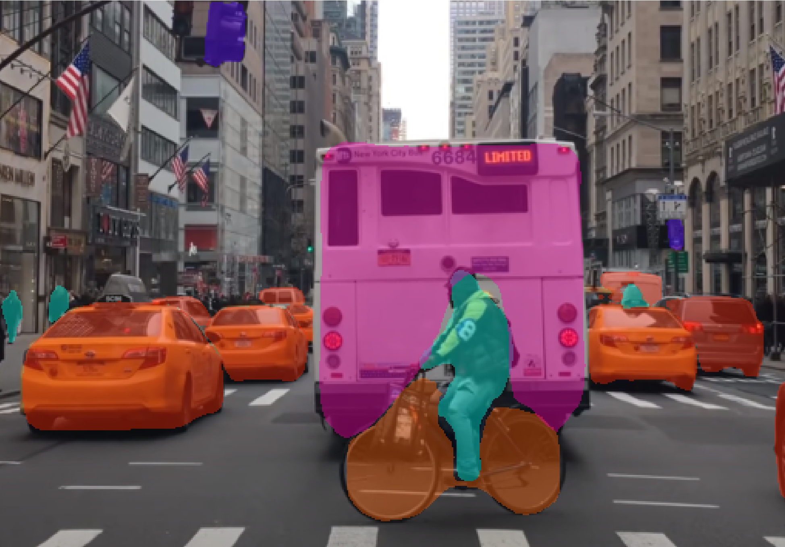

## Traffic segmentation using Mask-RCN 


<p align="center"></p>
<br>
<p align="center"></p>

### Install dependencies
```
pip install -r requirement.txt
git clone https://github.com/matterport/Mask_RCNN.git
cd Mask_RCNN
python setup.py install 
```


## Code
- [`Image_segmentation_maskrcnn.ipynb`](./Image_segmentation_maskrcnn.ipynb): Notebook of applying image segmentation with Mask-RCNN

## Credit
- [matterport](https://github.com/matterport/Mask_RCNN)
